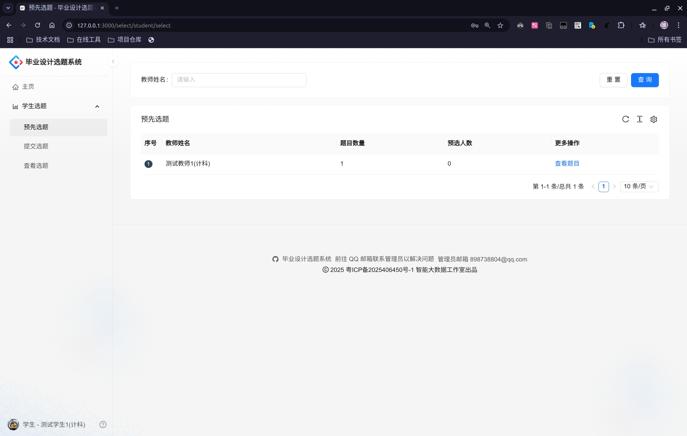

# 学生使用手册

## 操作流程

1. **持续关注并且大致浏览教师所出的毕设题目**
2. **确认预选毕业设计题目** 或 **取消预选毕业设计题目**
3. **确认提交毕业设计题目** 或 **取消提交毕业设计题目**

## 详细说明

学生应当在学生单选模式时，预选自己心仪的毕业设计题目（后续简称"题目"）。而在题目开放后可以预选题目（最多预选 10 条）。当教师单选环节结束后，学生才能开始抢夺题目，每个学生只能选择一个题目，并且成功之后无法再次预选题目（除非取消已经提交的题目）。

本系统提供退选题目的功能，但请慎重使用。若您发现无法取消当前已提交的题目，则需要联系题目所对应导师进行退选处理。

抢题过程中，请不要过分使用某些连点器工具来使用本系统，一旦被系统检测到账号异常行为将会进行临时封号，严重将导致影响您的选题安排。

## 简易演示过程

1. 学生在题目开放前，点击菜单栏"学生选题 → 预选选题"，可以查看不同教师所发布的题目
   

2. 虽然题目暂时还没有开放，但是可以点击"预选题目"进行预选
   

3. 开放后，点击菜单栏"提交选题"，确认后只能选择一个题目
   

4. 点击菜单栏"查看选题"后可以查看最终选得题目的详细信息
   