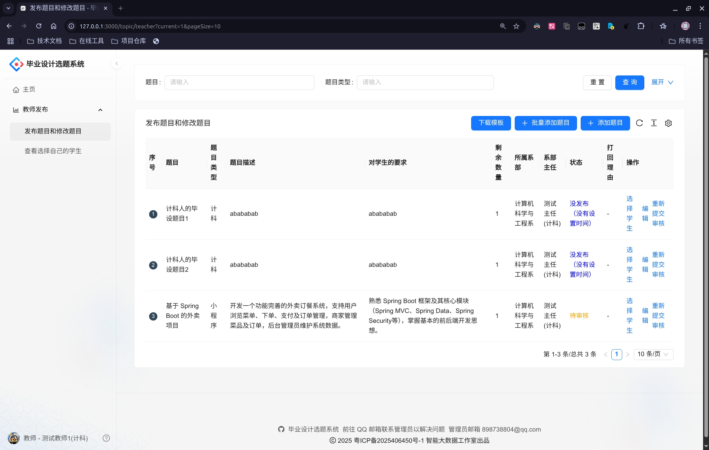
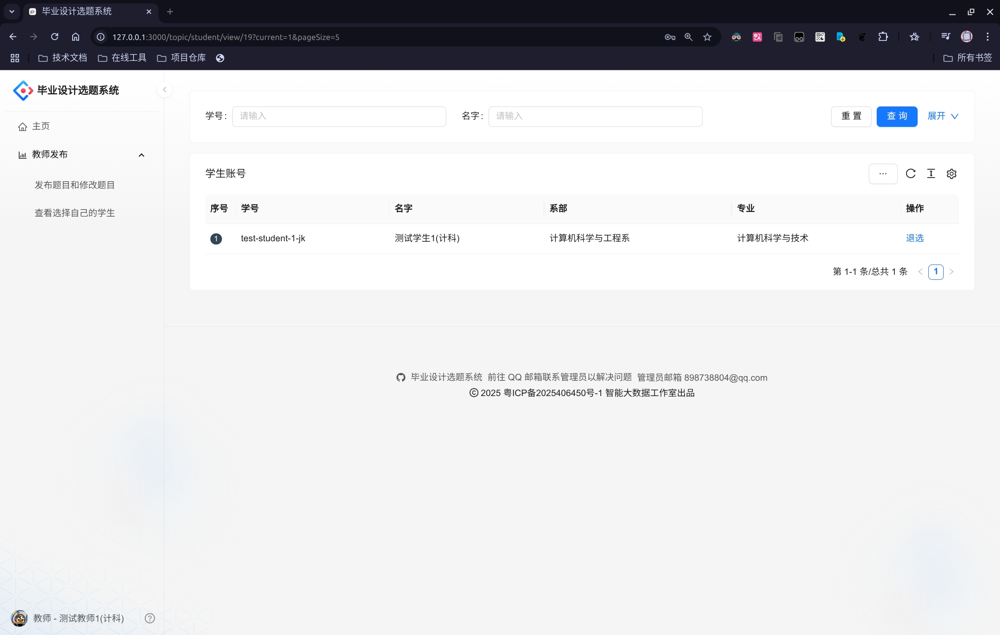

# 教师使用手册

## 操作流程

1. **发布题目** 或 **修改题目**
2. **查看题目状态**
3. **可以根据情况为已经审核通过的题目选择学生（双选）**

## 详细说明

教师应当在教师单选模式时，预先提交所出的毕业设计题目（后续简称"题目"）。不同教师的出题上限不同，而且在题目开放后可以提起选择题目所对应的学生。当教师单选模式环节结束后，学生才能开始抢夺题目。

本系统提供退选题目的功能，但请慎重使用。若您发现无法对某个学生进行退选，则需要联系管理员进行处理。

出题过程中，可以考虑使用 AI 检测工具来查验本题目是否和近三年的题目相同，请谨慎使用，每位教师一天最多使用 30 次 AI 校验工具，请珍惜使用。

## 简易演示过程

1. 点击菜单栏"教师发布 → 发布题目和修改题目"，这里可以看到自己发布的所有题目
   

2. 点击表格上方的"添加题目"，填写关于题目的信息表单，并且可以比较题目在 3 年内的相似程度（仅供参考）
   

3. 点击"提交"按钮后即可发布题目，等待主任审核题目通过
   

4. 点击表格列"操作"区域的"编辑"，修改后点击"保存"，即可更新选题（也可"删除"后重新添加）
   

5. 若题目状态为"打回"，需根据打回理由修改后，点击"重新提交审核"，进入"待审核"状态
   

6. 题目处于"已发布"状态后，教师可点击"操作"区域的"选择学生"，进行双选
   

7. 点击"教师发布 → 查看选择自己的学生"查看情况，可视情况点击"退选"帮助学生取消选题
   