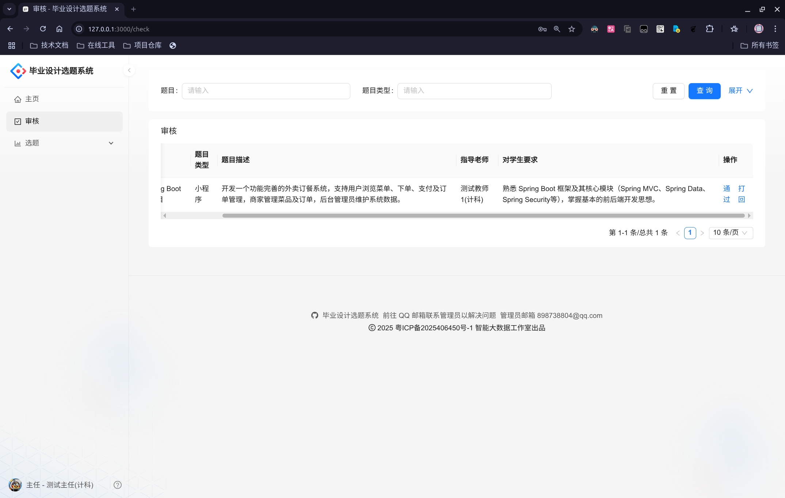
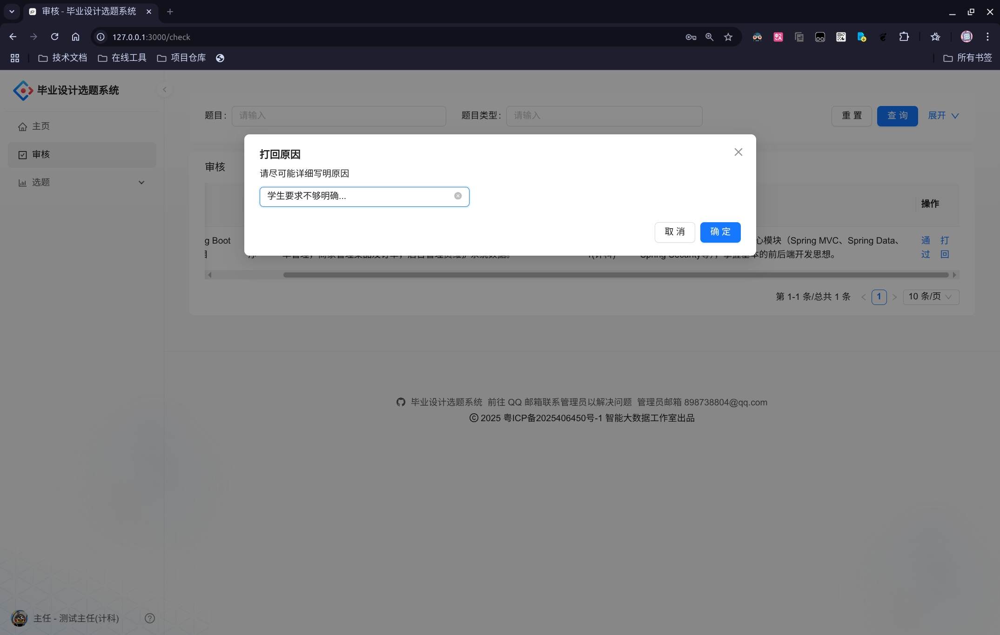
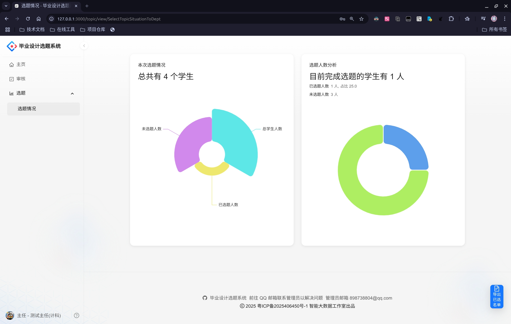

# 主任使用手册

## 操作流程

1. **审核题目（通过题目、打回题目）**
2. **查看本系部学生的选题情况**
3. **快速导出选题情况表格文件**

## 详细说明

主任应当在开启双选之前，审核本系所提交的所有毕业设计题目（后续简称"题目"）。教师所出的题目如果被打回，后续再次修改后可以重新提交审核。

本系统提供主任切换角色的特殊功能（满足主任也可以出题的条件），但使用有一些条件。若您发现无法快速切换身份，则需要联系管理员进行处理。

### 角色切换步骤

1. 使用主任帐号登录系统，在初始化帐号的时候，修改密码、绑定邮箱
2. 使用另外一个管理员提供的教师帐号登录系统，修改密码（需要保证和主任帐号相同）、绑定邮箱（需要保证和主任帐号相同），否则将无法切换角色
3. 然后就可以在对应的主任帐号或教师帐号中来回切换登陆（偶尔因为浏览器缓存的缘故需要刷新浏览器才生效，实在无法解决找管理员）

## 简易演示过程

1. 点击菜单栏的"审核"，即可查看本系教师提交的所有题目
   

2. 审核题目时，如需打回，需填写"打回理由"
   

3. 点击菜单栏"选题 → 选题情况"，可查看本系学生的选题情况，并支持导出详细的表格
   

4. 左下角（或右上角）可以选择退出登陆，也可以选择切换角色，方便主任可以作为教师出题
   